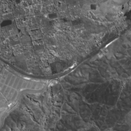
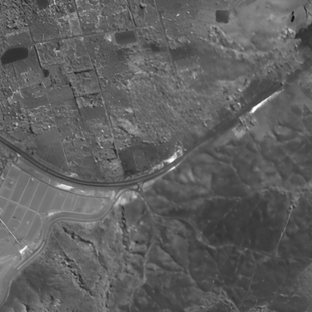

# Real-ESRGAN_Experimental

## Super Resolution using Real-ESRGAN for Satellite Imagery
This project demonstrates the application of Super Resolution techniques to enhance the quality of satellite imagery using the Real-ESRGAN model. The results showcase significant improvements in image clarity and detail.

## Project Overview

The primary objective of this project is to enhance low-resolution satellite images using the Real-ESRGAN model. The R-ESRGAN_apply.ipynb notebook provides a step-by-step implementation of the super-resolution process.

## Key Features:

- Input low-resolution satellite images.
- Application of Real-ESRGAN for super-resolution.
- Comparison between original and enhanced images.

## Results

Below are the results of applying super-resolution:

Input Image (Before Super Resolution):

Enhanced Image (After Super Resolution):

The enhanced image demonstrates improved sharpness and finer details compared to the original image.

### Credits

This project uses the Real-ESRGAN model by Xintao.

### License

This project is licensed under the MIT License. See the LICENSE file for details.
